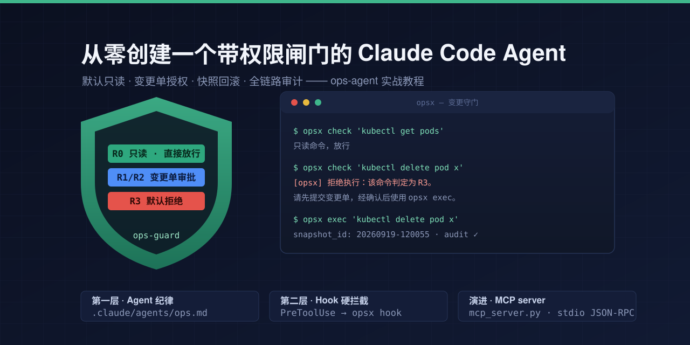

# 从零创建一个带权限闸门的 Claude Code Agent



> 本文以本仓库（ops-agent）的真实构建过程为线索，完整讲解如何设计并实现一个"默认只读、高风险操作需授权、可回滚、全审计"的 Claude Code 运维 Agent。所有代码均可在本仓库中对照阅读，文末附有改造清单，可复用到你自己的 Agent 场景。

## 0. 我们要造什么

一个运维 Agent，满足四个硬要求：

1. **默认只读** —— 查状态、看日志直接执行，无感通过。
2. **高风险操作需授权** —— 写操作必须先出"变更单"（风险说明 + 回滚计划），经用户在会话中显式批准后才能执行。
3. **可回滚** —— 执行前自动快照，一条命令回滚。
4. **全审计** —— 批准、校验、执行、中止，每个事件都落日志。

最终形态（本仓库）：

```
ops-agent/
├── .claude/
│   ├── agents/ops.md      # Agent 定义：第一层防线（prompt 纪律）
│   └── settings.json      # PreToolUse hook：第二层防线（硬拦截）
├── core.py                # 核心库：分类/审批戳/快照/回滚/审计（纯函数）
├── opsx                   # CLI 薄壳 + hook 入口
├── config.yaml            # 只读白名单 + R1/R2/R3 风险规则
├── selftest.py            # 内置自检（23 项断言）
├── mcp_server.py          # 演进产物：同一能力的 MCP server 形态
└── README.md
```

## 1. 设计阶段：先定权限模型，再写一行代码

这是整个项目最重要的一步。实现之前先回答这几个问题（当时的设计决策）：

| 决策点 | 选择 | 理由 |
|---|---|---|
| 审批方式 | 会话内人工确认（变更单 → 弹窗批准） | 最严格，无凭据外泄风险；比预存 API token 或全自动策略更贴合"谨慎"要求 |
| 快照方式 | 文件副本 + 状态抓取命令输出，存本地状态目录 | 简单、可靠、零依赖；数据库场景再扩展逻辑导出 |
| 目标环境 | 本机 macOS + 远程 Linux（SSH）+ K8s（kubeconfig）+ Docker | 覆盖个人/小团队真实运维面 |
| 演进预留 | core.py 写成纯函数库，不 import CLI 或 hook | 为后续包装成 MCP server 铺路（后文第 8 节兑现） |

然后是**风险分级模型**，全系统的基石：

- **R0 只读**：`kubectl get`、`systemctl status`、`docker ps`、日志检索、git 只读族。直接放行。
- **R1 可逆低风险写**：服务重启、docker restart。走轻量审批流程。
- **R2 高风险写**：部署、扩缩容、包安装、防火墙规则。走完整变更单流程。
- **R3 不可逆**：`rm -rf`、`kubectl delete`、`docker rm`、格式化、`DROP`。**默认拒绝**，需 `--force` + 用户显式确认。

三条派生原则，都是安全方向的默认值：

- 复合命令按 `;` `&&` `||` `|` 分段，**取最高风险级**。
- 不认识的命令**默认 R2**（宁高勿低，误放行代价远大于误拦截）。
- 白名单形状但带写标记（`>`、`>>`、`tee`、`-exec`、`-delete`）的，**不按只读放行**。

## 2. 仓库初始化

GitHub 建私有仓库后在本地初始化骨架。`.gitignore` 排除构建产物；状态目录不进仓库（`~/.ops-agent/` 放审批戳、快照、审计，是运行时状态，且可能含环境信息）。

```bash
mkdir ops-agent && cd ops-agent
git init
# .claude/agents/ops.md、.claude/settings.json、core.py、opsx、config.yaml、selftest.py
```

## 3. 第一层防线：Agent 定义

`.claude/agents/ops.md` 是 Claude Code 的子代理定义。frontmatter 决定它何时被调度和能用哪些工具：

```yaml
---
name: ops
description: 运维操作代理。默认只读；任何写操作必须按 R1/R2/R3 流程提交变更单并经用户确认后通过 opsx exec 执行。
tools: Bash, Read, Grep, Glob, AskUserQuestion
---
```

正文写**纪律**而非知识。三段最关键：

**最高原则**（放在文件开头，优先级最高）：

```markdown
1. **默认只读**：优先用只读命令查状态、看日志。写操作是例外，不是默认。
2. **所有写命令必须经 opsx exec 执行**，禁止直接 Bash 执行写操作。hook 会拦截未授权命令。
3. **禁止拆分命令规避审批**、禁止在复合命令里夹带未申报的命令段。
```

**R1/R2 强制流程**（变更单五步）：

1. 输出变更单：目标环境、完整命令、风险说明、回滚计划、快照计划。
2. AskUserQuestion 请用户确认。
3. 批准后先建审批戳：`opsx approve '<命令>'`
4. 原子执行（快照参数随命令一次传入）：`opsx exec '<命令>' --snapshot-file <路径> --snapshot-cmd 'name::<抓取状态的命令>'`
5. 报告结果、snapshot_id、回滚命令。

**R3 流程**：默认拒绝；仅用户显式确认后，先 `opsx approve '<命令>' --force` 再 exec。

> **经验**：prompt 纪律是"软"防线——它约束行为端正的 Agent，但拦不住异常输出。所以必须有第二层。

## 4. 第二层防线：PreToolUse 硬拦截

`.claude/settings.json` 注册 hook，对每次 Bash 工具调用先过闸门：

```json
{
  "hooks": {
    "PreToolUse": [
      {
        "matcher": "Bash",
        "hooks": [
          { "type": "command",
            "command": "python3 \"$CLAUDE_PROJECT_DIR/opsx\" hook",
            "timeout": 10 }
        ]
      }
    ]
  }
}
```

hook 从 stdin 读 JSON，取 `tool_input.command` 分类，**exit 0 放行、exit 2 拒绝**。两条铁律：

- **fail-closed**：任何异常（解析失败、空命令、core 报错）一律 return 2 拒绝，绝不静默放行。
- 提示语要指路：拒绝时告诉 Agent"请向用户提交变更单，经确认后用 opsx exec 执行"——拦截不是终点，是把行为引导回正确流程。

```python
# opsx 的 hook 入口
try:
    data = json.load(sys.stdin)
    command = data.get("tool_input", {}).get("command", "")
    if not command.strip():
        return 2
    code, msg = core.check(command)
    ...
    return code
except Exception as e:      # hook 异常一律拒绝方向
    print(f"[opsx] hook 异常，拒绝执行: {e}", file=sys.stderr)
    return 2
```

这是项目级配置，**必须在仓库目录内启动 Claude Code 才生效**——目录外只剩 prompt 一层。

## 5. 核心库 core.py：五个模块

纯标准库、纯函数，CLI 和后来的 MCP server 共用。五个职责各一个函数族：

### 5.1 分类（`classify` / `_classify_single`）

先按复合命令分隔符分段，逐段匹配，取最高级。单段的判定顺序：

```python
write_marker = re.search(r"(?:^|[^0-9])>{1,2}|\btee\b|-exec\b|-delete\b", seg)
for pat in config["readonly_patterns"]:
    if re.search(pat, seg):
        if write_marker:
            break            # 白名单形状但带写标记：落入风险规则
        return "R0"
for pat in config["risk_rules"]["R3"]: ...
for pat in config["risk_rules"]["R2"]: ...
for pat in config["risk_rules"]["R1"]: ...
return "R2"                  # 未知命令安全方向默认
```

写标记正则里 `[^0-9]` 是为了豁免 fd 重定向（`2>/dev/null` 是纯只读命令的常见尾巴）。

### 5.2 审批戳（`approve` / `check_stamp` / `check`）

审批戳 = 归一化命令的 sha256 + TTL + 级别，存 `~/.ops-agent/approvals/<hash>.json`：

- R0 拒绝建戳（只读不需要授权，建了反而是漏洞）。
- R3 必须 `force=True`。
- `check` 每次调用都写审计，无论放行还是拒绝。

### 5.3 审计（`audit`）

JSONL 追加写，单文件超 10MB 轮转为 `audit.jsonl.1`。字段带 UTC 时间戳，事件类型覆盖 `approve` / `check` / `exec` / `exec-abort` / `snapshot` / `rollback` / `prune`。

### 5.4 快照（`snapshot_file` / `snapshot_cmd` / `rollback`）

每次快照一个目录：`~/.ops-agent/snapshots/<id>/`，内含 `meta.json` + 文件副本（保留权限位）+ 状态命令输出。`rollback` 按 meta 逐项恢复，默认保留最近 200 个快照（`prune_snapshots`）。

### 5.5 原子执行（`exec_change`）

顺序严格不可乱：**校验戳 → 快照 → 执行 → 审计**。快照任何一步失败，清理快照目录、写 `exec-abort` 审计、返回 3，**命令不会执行**：

```python
except (OpsxError, subprocess.SubprocessError, OSError) as e:
    shutil.rmtree(d, ignore_errors=True)
    print(f"[opsx] 快照失败，已中止执行: {e}", file=sys.stderr)
    audit("exec-abort", cmd=cmd, reason=str(e))
    return 3
```

`opsx` 只是 argparse 薄壳，把子命令映射到这五个函数上，外加 `selftest` 和 `hook` 入口。

## 6. 配置：config.yaml

两段：`readonly_patterns`（白名单，按顺序匹配）和 `risk_rules` 下的 `R1`/`R2`/`R3`（原始正则）。用极简行解析器读（不引 YAML 依赖），并支持 `~/.ops-agent/config.override.yaml` 追加覆盖——**改规则不用改代码**。

维护要点：白名单只收"输出型"命令；同族命令按动词拆（`git status` 只读、`git push` 不写白名单）；R3 宁可多列（`systemctl stop/disable/mask` 都收进来）。本项目后期就是把 `git` 只读族补进白名单的一次常规迭代——白名单是活的，随使用生长。

## 7. 实战运行：一次完整演示

在仓库目录内启动 `claude` 后（hook 自动生效），真实流程如下。

**第一步，只读诊断**（R0，无感通过）：

```bash
df -h / | tail -1; docker ps --format '{{.Names}}\t{{.Status}}'
```

**第二步，写操作出变更单**。Agent 输出：

> **变更单 #demo-001**
> - 目标：本机 macOS
> - 命令：`echo opsx-demo > /tmp/opsx-demo.txt`
> - 风险（R2）：白名单外写操作，新建文件覆盖风险低
> - 回滚：新建文件，回滚即删除该文件
> - 快照计划：N/A（目标文件不存在）

用户在弹窗中选择"批准执行"。

**第三步，建戳 + 原子执行**：

```bash
./opsx approve 'echo opsx-demo > /tmp/opsx-demo.txt'
./opsx exec 'echo opsx-demo > /tmp/opsx-demo.txt' --snapshot-file /tmp/opsx-demo.txt
```

演示中故意踩了一次线：给不存在的目标文件传 `--snapshot-file`，快照失败 → **exec 中止、未执行任何变更**，审计记下 `exec-abort`。新建文件类变更本就不需要快照，去掉参数重跑即成功。

**第四步，审计链**（`./opsx audit --tail 5`）：

```json
{"event": "approve",     "cmd": "echo opsx-demo > /tmp/opsx-demo.txt", "level": "R2", "ttl": 900}
{"event": "check",       "result": "allow-stamp"}
{"event": "exec-abort",  "reason": "快照源不是文件: /tmp/opsx-demo.txt"}
{"event": "check",       "result": "allow-stamp"}
{"event": "exec",        "snapshot_id": null, "exit_code": 0}
```

批准 → 校验 → 中止 → 再校验 → 执行，五步全可追溯。

## 8. 演进：从子代理到 MCP server

子代理形态只对仓库目录内的会话生效。要让能力跨项目可用，把同一组 core.py 函数包成 stdio JSON-RPC 的 MCP server（`mcp_server.py`，仍是纯标准库）：

- 协议四件套：`initialize` / `tools/list` / `tools/call` / `ping`，通知类消息无 id 不回。
- 8 个工具，只读的 `ops_check` / `ops_list` / `ops_audit` 标 `readOnlyHint`。
- 错误码遵守 JSON-RPC 约定；业务错误走 tool 结果的 `isError`，不污染协议层。
- 因为 core.py 是纯函数库，server 只是"换个入口"，状态目录布局不变——**CLI 批的审批戳，MCP 下同样有效**。

注册一次，全局可用：

```bash
claude mcp add ops-guard -- python3 /Users/neo/vscode/mengbin/ops-agent/mcp_server.py
```

权限建议：三个只读工具加进 `permissions.allow` 免弹窗，写工具保持每次弹窗（弹窗即第二重人工确认），审批戳仍是硬闸门。

## 9. 踩过的坑（都是教训）

1. **fail-closed 没有例外**。hook 异常、配置解析失败、快照失败——全部走"拒绝/中止"方向。误拦截只是多一次批准，误放行就是事故。
2. **白名单必须防写标记逃逸**。`cat a > b` 形状像只读，实际是写。写标记正则这一行漏洞，比十个缺失的正则条目更危险。
3. **复合命令按最高级**。`kubectl get pods && kubectl delete pod x` 必须整体按 R3 处理，分段取 max 即可，不需要 shell AST。
4. **快照失败即中止，不留半提交状态**。变更执行宁可没做成，也不要做成一半。
5. **未知默认高级别**。分类器是正则不是理解，认不出的命令按 R2 起步。
6. **审批戳要 TTL + 归一化**。无期限的戳等于永久后门；归一化（压缩空白）防止同一命令因空格差异绕过哈希。
7. **自检要隔离状态目录**。`selftest.py` 在 import core 前设置 `OPSX_STATE_DIR` 指向临时目录，否则测试会往真实 `~/.ops-agent` 写戳。
8. **架构上把"库"和"壳"分开**。core.py 不 import argparse/JSON-RPC，才有后面零成本长出 CLI、hook、MCP 三个壳。

已知边界也要写进文档：审批戳防"误执行"不防"恶意 Agent"（戳由 Agent 侧在确认后创建）；分类是线性正则，不解析 shell AST。

## 10. 制作你自己的 Agent：清单

换一个领域（数据库管理员、云资源操作、发布工程师……）时，复用这套骨架：

- [ ] **定风险分级**：你的领域里什么是"只读"、什么是"可逆"、什么是"不可逆"？分级表先于代码。
- [ ] **写 Agent 定义**：frontmatter 收窄 tools 列表；正文只写纪律（默认行为、强制流程、禁止事项），不堆砌知识。
- [ ] **定审批载体**：变更单格式 + 确认方式（弹窗/口令/外部系统），降级路径（`opsx approve` 手动预授权）要在。
- [ ] **写分类器**：白名单 + 分级正则 + 复合命令取最高级 + 未知默认高级别 + 写标记逃逸防护。
- [ ] **写执行器**：校验 → 快照 → 执行 → 审计，快照失败即中止。
- [ ] **配 hook**：PreToolUse 匹配你的工具，fail-closed，拒绝语指路。
- [ ] **写自检**：断言式，隔离状态目录，覆盖分类边界和一次完整的批-执行-回滚环。
- [ ] **跑一遍真实流程**：只读 → 变更单 → 批准 → 执行 → 审计 → 回滚，用审计链验证而不是用嘴验证。
- [ ] **写已知边界**：防什么、不防什么，写在 README 里——诚实比完备重要。
- [ ] （可选）**包 MCP server**：库壳分离的前提下，这是最后一层薄壳的工作量。

---

*本教程基于 ops-agent 的实际构建过程整理（设计 → 实现 → 实战 → MCP 演进），仓库地址：https://github.com/mengbin92/ops-agent*
